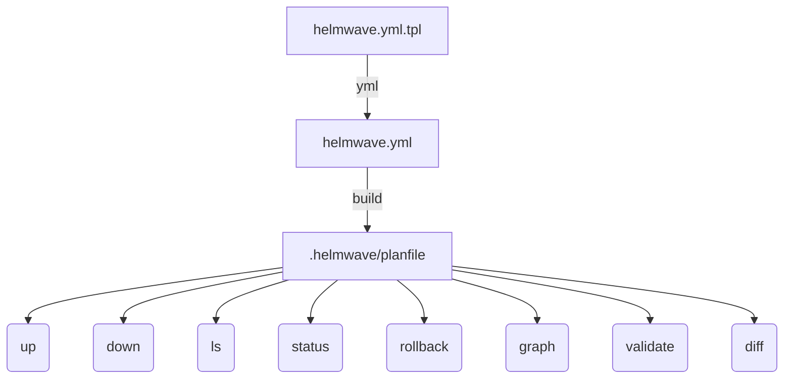

# 🛠 CLI Reference

```
NAME:
   helmwave - is like docker-compose for helm

USAGE:
   helmwave [global options] command [command options] [arguments...]

VERSION:
   0.27.3

DESCRIPTION:
   This tool helps you compose your helm releases!
   0. $ helmwave yml
   1. $ helmwave build
   2. $ helmwave up


COMMANDS:
   build         🏗 Build a plan
   diff, vs      🆚 Show Differences
   up            🚢 Apply your plan
   list, ls      👀 List of deployed releases
   rollback      ⏮ Rollback your plan
   status        👁️ Status of deployed releases
   down          🔪 Delete all
   validate      🛂 validate your plan
   yml           📄 render helmwave.yml.tpl -> helmwave.yml
   schema        generate json schema
   graph         show graph
   version, ver  show shorts version
   completion    generate completion script
   help, h       Shows a list of commands or help for one command

GLOBAL OPTIONS:
   --log-format value  You can set: [ text | json | pad | emoji ] (default: "emoji") [$HELMWAVE_LOG_FORMAT]
   --log-level value   You can set: [ debug | info | warn  | fatal | panic | trace ] (default: "info") [$HELMWAVE_LOG_LEVEL, $HELMWAVE_LOG_LVL]
   --log-color         Force color (default: true) [$HELMWAVE_LOG_COLOR]
   --log-timestamps    Add timestamps to log messages (default: false) [$HELMWAVE_LOG_TIMESTAMPS]
   --help, -h          show help
   --version, -v       print the version

```



## step 0: templating

### `yml`

This command renders `helmwave.yml.tpl` to `helmwave.yml`.

!!! info "Flags"

    ```shell
    --tpl value             Main tpl file (default: "helmwave.yml.tpl") [$HELMWAVE_TPL]
    --file value, -f value  Main yml file (default: "helmwave.yml") [$HELMWAVE_YAML, $HELMWAVE_YML]
    --templater value       Select template engine: sprig or gomplate (default: "sprig") [$HELMWAVE_TEMPLATER, $HELMWAVE_TEMPLATE_ENGINE]
    ```


## step 1: building a plan

Helmwave builds plan in complete plan directory (`.helmwave` by default) that other commands use.

A plan includes:

- Downloaded remote charts
- Downloaded and templated all used values files
- Rendered manifests for each release
- Markdown file with dependency graph as mermaid diagram
- Rendered `helmwave.yml` that uses plan files (e.g., downloaded chart and values)

### `build`

This command generates a plan.

As you can see, [`build`](#build) command includes [`yml`](#yml) command flags. 
You can pass `--yml` flag into [`build`](#build) command for launching [`yml`](#yml) command before building a plan.

!!! info "Flags"

    ```shell
    --plandir value, -p value                          path to plandir (default: ".helmwave/") [$HELMWAVE_PLANDIR, $HELMWAVE_PLAN]
    --tags value, -t value [ --tags value, -t value ]  build releases by tags: -t tag1 -t tag3,tag4 [$HELMWAVE_TAGS]
    --match-all-tags                                   match all provided tags (default: false) [$HELMWAVE_MATCH_ALL_TAGS]
    --graph-width value                                set ceil width: 1 – disable graph; 0 – full names; N>1 – show only N symbols; N<0 – drop N symbols from end. (default: 0) [$HELMWAVE_GRAPH_WIDTH]
    --skip-unchanged                                   skip unchanged releases (default: false) [$HELMWAVE_SKIP_UNCHANGED]
    --diff-mode value                                  You can set: [ live | local | none ] (default: "live") [$HELMWAVE_DIFF_MODE]
    --charts-cache-dir value                           enable caching of helm charts in specified directory [$HELMWAVE_CHARTS_CACHE]
    --yml                                              auto helmwave.yml.tpl --> helmwave.yml (default: false) [$HELMWAVE_AUTO_YML, $HELMWAVE_AUTO_YAML]
    --wide value                                       show line around changes (default: 5) [$HELMWAVE_DIFF_WIDE]
    --show-secret                                      show secret in diff (default: true) [$HELMWAVE_DIFF_SHOW_SECRET]
    --3-way-merge                                      show 3-way merge diff (default: false) [$HELMWAVE_DIFF_3_WAY_MERGE]
    --tpl value                                        main tpl file (default: "helmwave.yml.tpl") [$HELMWAVE_TPL]
    --file value, -f value                             main yml file (default: "helmwave.yml") [$HELMWAVE_YAML, $HELMWAVE_YML]
    --templater value                                  select template engine: [ sprig | gomplate ] (default: "sprig") [$HELMWAVE_TEMPLATER, $HELMWAVE_TEMPLATE_ENGINE]
    --help, -h                                         show help
    ```
    


## step 2: working with plan

When the plan is ready, you can use it for other commands.

Any commands below has `--build` flag that [builds](#build) a plan before executing command. 
And you can also use `--yml` flag that renders `helmwave.yml.tpl` to `helmwave.yml` before running `--build` command.

### `up`

Helmwave will install repositories and helm-releases from a plan.

!!! info "Flags"

    ```shell
    --build                                            auto build (default: false) [$HELMWAVE_AUTO_BUILD]
    --kubedog                                          enable/disable kubedog (default: false) [$HELMWAVE_KUBEDOG_ENABLED, $HELMWAVE_KUBEDOG]
    --kubedog-status-interval value                    interval of kubedog status messages (default: 5s) [$HELMWAVE_KUBEDOG_STATUS_INTERVAL]
    --kubedog-start-delay value                        delay kubedog start, don't make it too late (default: 1s) [$HELMWAVE_KUBEDOG_START_DELAY]
    --kubedog-timeout value                            timeout of kubedog multitrackers (default: 5m0s) [$HELMWAVE_KUBEDOG_TIMEOUT]
    --kubedog-log-width value                          Set kubedog max log line width (default: 140) [$HELMWAVE_KUBEDOG_LOG_WIDTH]
    --progress                                         Enable progress logs of helm (INFO log level) (default: false) [$HELMWAVE_PROGRESS]
    --parallel-limit value                             Limit amount of parallel releases (default: 0) [$HELMWAVE_PARALLEL_LIMIT]
    --plandir value, -p value                          path to plandir (default: ".helmwave/") [$HELMWAVE_PLANDIR, $HELMWAVE_PLAN]
    --tags value, -t value [ --tags value, -t value ]  build releases by tags: -t tag1 -t tag3,tag4 [$HELMWAVE_TAGS]
    --match-all-tags                                   match all provided tags (default: false) [$HELMWAVE_MATCH_ALL_TAGS]
    --graph-width value                                set ceil width: 1 – disable graph; 0 – full names; N>1 – show only N symbols; N<0 – drop N symbols from end. (default: 0) [$HELMWAVE_GRAPH_WIDTH]
    --skip-unchanged                                   skip unchanged releases (default: false) [$HELMWAVE_SKIP_UNCHANGED]
    --diff-mode value                                  You can set: [ live | local | none ] (default: "live") [$HELMWAVE_DIFF_MODE]
    --charts-cache-dir value                           enable caching of helm charts in specified directory [$HELMWAVE_CHARTS_CACHE]
    --yml                                              auto helmwave.yml.tpl --> helmwave.yml (default: false) [$HELMWAVE_AUTO_YML, $HELMWAVE_AUTO_YAML]
    --wide value                                       show line around changes (default: 5) [$HELMWAVE_DIFF_WIDE]
    --show-secret                                      show secret in diff (default: true) [$HELMWAVE_DIFF_SHOW_SECRET]
    --3-way-merge                                      show 3-way merge diff (default: false) [$HELMWAVE_DIFF_3_WAY_MERGE]
    --tpl value                                        main tpl file (default: "helmwave.yml.tpl") [$HELMWAVE_TPL]
    --file value, -f value                             main yml file (default: "helmwave.yml") [$HELMWAVE_YAML, $HELMWAVE_YML]
    --templater value                                  select template engine: [ sprig | gomplate ] (default: "sprig") [$HELMWAVE_TEMPLATER, $HELMWAVE_TEMPLATE_ENGINE]
    --help, -h                                         show help
    ```

### `down`

Helmwave will uninstall helm-releases from plan.

```bash
$ helmwave down      
[🙃 aka INFO]: ✅ frontend@test uninstalled!
[🙃 aka INFO]: ✅ database@test uninstalled!
[🙃 aka INFO]: ✅ backend@test uninstalled!
```

### `ls`

Helmwave will get a list of helm-releases from a plan.

```bash
$ helmwave ls      
[🙃 aka INFO]: Should be 3 releases
   NAME    | NAMESPACE | REVISION |            UPDATED             |  STATUS  | CHART | VERSION  
-----------+-----------+----------+--------------------------------+----------+-------+----------
  frontend | test      |        1 | 2021-11-10 04:41:23.330989     | deployed | this  | 0.1.0    
           |           |          | +0300 MSK                      |          |       |          
  database | test      |        1 | 2021-11-10 04:41:23.353473     | deployed | this  | 0.1.0    
           |           |          | +0300 MSK                      |          |       |          
  backend  | test      |        1 | 2021-11-10 04:41:23.270076     | deployed | this  | 0.1.0    
           |           |          | +0300 MSK                      |          |       |
```


### `status`

Helmwave try getting status of helm-releases from plan.

```bash
$ helmwave status      
[🙃 aka INFO]: Status of frontend@test
        status: deployed
        revision: 1
        name: frontend
        namespace: test
        chart: frontend-0.1.0
        last deployed: 2021-11-10 04:41:23.330989 +0300 MSK
[🙃 aka INFO]: Status of database@test
        status: deployed
        revision: 1
        name: database
        namespace: test
        chart: database-0.1.0
        last deployed: 2021-11-10 04:41:23.353473 +0300 MSK
[🙃 aka INFO]: Status of backend@test
        name: backend
        namespace: test
        chart: backend-0.1.0
        last deployed: 2021-11-10 04:41:23.270076 +0300 MSK
        status: deployed
        revision: 1
```

### `rollback`

Rollback helm-releases from plan.

```bash
$ helmwave rollback      
[🙃 aka INFO]: ✅ frontend@test rollback!
[🙃 aka INFO]: ✅ database@test rollback!
[🙃 aka INFO]: ✅ backend@test rollback!
```

### `graph`

Show only graph of helm releases from plan.

You can use `--graph-width` option to set width of graph.


### `validate`

Helmwave will validate plan.

!!! info "You should know that helmwave always validate plan before any command."

### `diff`

Diff has 2 subcommands 

- `helmwave diff live` will diff with manifests in the k8s-cluster 
- `helmwave diff plan` will diff with your another local plan.

---

## Logs

> Logs options. Helmwave use [logrus](https://github.com/sirupsen/logrus) as internal logger.

### Log Format

Helmwave supports several log-format

|    features    |                   `text`                    |                   `json`                    |                    `pad`                    |                                         `emoji` (default)                                         |
|:--------------:|:-------------------------------------------:|:-------------------------------------------:|:-------------------------------------------:|:-------------------------------------------------------------------------------------------------:|
|     Color      |                      ✅                      |                      ❌                      |                      ✅                      |                                                🌈                                                 |
| Human readable |                     🧐                      |                     🤖                      |                    🧐🧐                     |                                                 ✅                                                 |
|  Performance   |                     🚀                      |                     🐢                      |                     ✈️                      |                                                🐢                                                 |
|     Module     | TextFormatter (in-built `logrus` formatter) | JSONFormatter (in-built `logrus` formatter) | TextFormatter (in-built `logrus` formatter) | [logrus-emoji-formatter](https://github.com/helmwave/logrus-emoji-formatter) special for helmwave |

### Log Level

|             _              | `info` (default) | `warn` | `debug` | `fatal` | `panic` | `trace` |
|:--------------------------:|:----------------:|:------:|:-------:|:-------:|:-------:|:-------:|
|        general info        |        ✅         |   ✅    |    ✅    |    ✅    |    ✅    |    ✅    |
|    incompatible version    |        ❌         |   ✅    |    ✅    |    ✅    |    ✅    |    ✅    |
|         helm-debug         |        ❌         |   ❌    |    ✅    |    ✅    |    ✅    |    ✅    |
|        file content        |        ❌         |   ❌    |    ✅    |    ✅    |    ✅    |    ✅    |
| helm manifests, bug report |        ❌         |   ❌    |    ❌    |    ❌    |    ❌    |    ✅    |

`info` is preferred loglevel.

You can enable `--progress` flag for helm-debug output.

### How to use?

```bash
helmwave --log-color=true --log-level=debug --log-format=pad <cmd>
```

or

```bash
export HELMWAVE_LOG_FORMAT=pad
export HELMWAVE_LOG_LEVEL=debug
export HELMWAVE_LOG_COLOR=true
helmwave <cmd>
```


## Get Version

=== "Long version"

    ```bash
    $ helmwave --version  
    helmwave version 0.27.3
    
    $ helmwave -v
    helmwave version 0.27.3
    ```

=== "Short version"

    ```bash
    $ helmwave version
    0.27.3
    
    $ helmwave ver
    0.27.3
    ```

## Completion

=== ":material-bash: bash"

    Add this code to your ~/.bashrc
    
    ```bash
    source <(helmwave completion bash)
    ```

    ```bash
    echo "source <(helmwave completion bash)" >> ~/.bashrc
    ```

    

=== ":material-bash: zsh"

    Add this code to your ~/.zshrc
    
    ```bash
    source <(helmwave completion zsh)
    ```
    
    ```bash
    echo "source <(helmwave completion zsh)" >> ~/.zshrc
    ```
    
    

## schema

You can generate json schema for autocomplete and validate `helmwave.yml` in your IDE.

```shell
helmwave schema > helmwave.schema.json
```