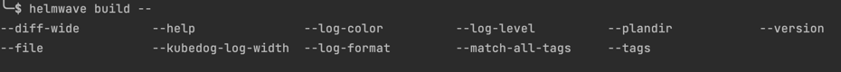

# 🛠 CLI Reference

```
NAME:
   helmwave - is like docker-compose for helm

USAGE:
   helmwave [global options] command [command options] [arguments...]

VERSION:
   0.24.0

DESCRIPTION:
   This tool helps you compose your helm releases!
   0. $ helmwave yml
   1. $ helmwave build
   2. $ helmwave up


COMMANDS:
   build         🏗 Build a plan
   diff, vs      🆚 Show Differences
   up            🚢 Apply your plan
   list, ls      👀 List of deployed releases
   rollback      ⏮  Rollback your plan
   status        👁️ Status of deployed releases
   down          🔪 Delete all
   validate      🛂 Validate your plan
   yml           📄 Render helmwave.yml.tpl -> helmwave.yml
   schema        Generate helmwave json schema
   version, ver  Show shorts version
   completion    Generate completion script
   help, h       Shows a list of commands or help for one command

GLOBAL OPTIONS:
   --log-format value         You can set: [ text | json | pad | emoji ] (default: "emoji") [$HELMWAVE_LOG_FORMAT]
   --log-level value          You can set: [ debug | info | warn  | fatal | panic | trace ] (default: "info") [$HELMWAVE_LOG_LEVEL, $HELMWAVE_LOG_LVL]
   --log-color                Force color (default: true) [$HELMWAVE_LOG_COLOR]
   --kubedog-log-width value  Set kubedog max log line width (default: 140) [$HELMWAVE_KUBEDOG_LOG_WIDTH]
   --log-timestamps           Add timestamps to log messages (default: false) [$HELMWAVE_LOG_TIMESTAMPS]
   --help, -h                 show help (default: false)
   --version, -v              print the version (default: false)
```

## step #2: Working with plan

### build

Helmwave builds plan in complete plan directory (`.helmwave` by default) that other commands use.

Plan includes:

- Downloaded remote charts
- Downloaded and templated all used values files
- Rendered manifests for each release
- Markdown file with dependencies graph as mermaid diagram
- Rendered `helmwave.yml` that uses plan files (e.g. downloaded chart and values)

```console
NAME:
   helmwave build - 🏗 Build a plan

USAGE:
   helmwave build [command options] [arguments...]

OPTIONS:
   --plandir value, -p value                          Path to plandir (default: ".helmwave/") [$HELMWAVE_PLANDIR, $HELMWAVE_PLAN]
   --tags value, -t value [ --tags value, -t value ]  It allows you choose releases for sync. Example: -t tag1 -t tag3,tag4 [$HELMWAVE_TAGS]
   --match-all-tags                                   Match all provided tags (default: false) [$HELMWAVE_MATCH_ALL_TAGS]
   --diff-mode value                                  You can set: [ live | local ] (default: "live") [$HELMWAVE_DIFF_MODE]
   --charts-cache-dir value                           Enable caching of helm charts in specified directory [$HELMWAVE_CHARTS_CACHE]
   --yml                                              Auto helmwave.yml.tpl --> helmwave.yml (default: false) [$HELMWAVE_AUTO_YML, $HELMWAVE_AUTO_YAML]
   --wide value                                       Show line around change (default: 5) [$HELMWAVE_DIFF_WIDE]
   --show-secret                                      Show secret in diff (default: true) [$HELMWAVE_DIFF_SHOW_SECRET]
   --tpl value                                        Main tpl file (default: "helmwave.yml.tpl") [$HELMWAVE_TPL]
   --file value, -f value                             Main yml file (default: "helmwave.yml") [$HELMWAVE_YAML, $HELMWAVE_YML]
   --templater value                                  Select template engine: sprig or gomplate (default: "sprig") [$HELMWAVE_TEMPLATER, $HELMWAVE_TEMPLATE_ENGINE]
   --help, -h                                         show help (default: false)
```

### up

Helmwave will install repositories and helm-releases from plan.

```console
NAME:
   helmwave up - 🚢 Apply your plan

USAGE:
   helmwave up [command options] [arguments...]

OPTIONS:
   --build                                            auto build (default: false) [$HELMWAVE_AUTO_BUILD]
   --kubedog                                          Enable/Disable kubedog (default: false) [$HELMWAVE_KUBEDOG_ENABLED, $HELMWAVE_KUBEDOG]
   --kubedog-status-interval value                    Interval of kubedog status messages (default: 5s) [$HELMWAVE_KUBEDOG_STATUS_INTERVAL]
   --kubedog-start-delay value                        Delay kubedog start, don't make it too late (default: 1s) [$HELMWAVE_KUBEDOG_START_DELAY]
   --kubedog-timeout value                            Timeout of kubedog multitrackers (default: 5m0s) [$HELMWAVE_KUBEDOG_TIMEOUT]
   --progress                                         Enable progress logs of helm (INFO log level) (default: false) [$HELMWAVE_PROGRESS]
   --parallel-limit value                             Limit amount of parallel releases (default: 0) [$HELMWAVE_PARALLEL_LIMIT]
   --plandir value, -p value                          Path to plandir (default: ".helmwave/") [$HELMWAVE_PLANDIR, $HELMWAVE_PLAN]
   --tags value, -t value [ --tags value, -t value ]  It allows you choose releases for sync. Example: -t tag1 -t tag3,tag4 [$HELMWAVE_TAGS]
   --match-all-tags                                   Match all provided tags (default: false) [$HELMWAVE_MATCH_ALL_TAGS]
   --diff-mode value                                  You can set: [ live | local ] (default: "live") [$HELMWAVE_DIFF_MODE]
   --yml                                              Auto helmwave.yml.tpl --> helmwave.yml (default: false) [$HELMWAVE_AUTO_YML, $HELMWAVE_AUTO_YAML]
   --wide value                                       Show line around change (default: 5) [$HELMWAVE_DIFF_WIDE]
   --show-secret                                      Show secret in diff (default: true) [$HELMWAVE_DIFF_SHOW_SECRET]
   --tpl value                                        Main tpl file (default: "helmwave.yml.tpl") [$HELMWAVE_TPL]
   --file value, -f value                             Main yml file (default: "helmwave.yml") [$HELMWAVE_YAML, $HELMWAVE_YML]
   --templater value                                  Select template engine: sprig or gomplate (default: "sprig") [$HELMWAVE_TEMPLATER, $HELMWAVE_TEMPLATE_ENGINE]
   --help, -h                                         show help (default: false)
```

### down

Helmwave will uninstall helm-releases from plan.

```console
NAME:
   helmwave down - 🔪 Delete all

USAGE:
   helmwave down [command options] [arguments...]

OPTIONS:
   --build                                            auto build (default: false) [$HELMWAVE_AUTO_BUILD]
   --plandir value, -p value                          Path to plandir (default: ".helmwave/") [$HELMWAVE_PLANDIR, $HELMWAVE_PLAN]
   --tags value, -t value [ --tags value, -t value ]  It allows you choose releases for sync. Example: -t tag1 -t tag3,tag4 [$HELMWAVE_TAGS]
   --match-all-tags                                   Match all provided tags (default: false) [$HELMWAVE_MATCH_ALL_TAGS]
   --diff-mode value                                  You can set: [ live | local ] (default: "live") [$HELMWAVE_DIFF_MODE]
   --yml                                              Auto helmwave.yml.tpl --> helmwave.yml (default: false) [$HELMWAVE_AUTO_YML, $HELMWAVE_AUTO_YAML]
   --wide value                                       Show line around change (default: 5) [$HELMWAVE_DIFF_WIDE]
   --show-secret                                      Show secret in diff (default: true) [$HELMWAVE_DIFF_SHOW_SECRET]
   --tpl value                                        Main tpl file (default: "helmwave.yml.tpl") [$HELMWAVE_TPL]
   --file value, -f value                             Main yml file (default: "helmwave.yml") [$HELMWAVE_YAML, $HELMWAVE_YML]
   --templater value                                  Select template engine: sprig or gomplate (default: "sprig") [$HELMWAVE_TEMPLATER, $HELMWAVE_TEMPLATE_ENGINE]
   --help, -h                                         show help (default: false)
```

```bash
$ helmwave down      
[🙃 aka INFO]: ✅ frontend@test uninstalled!
[🙃 aka INFO]: ✅ database@test uninstalled!
[🙃 aka INFO]: ✅ backend@test uninstalled!
```

### ls

Helmwave try getting list of helm-releases from plan.

```bash
$ helmwave ls      
[🙃 aka INFO]: Should be 3 releases
   NAME    | NAMESPACE | REVISION |            UPDATED             |  STATUS  | CHART | VERSION  
-----------+-----------+----------+--------------------------------+----------+-------+----------
  frontend | test      |        1 | 2021-11-10 04:41:23.330989     | deployed | this  | 0.1.0    
           |           |          | +0300 MSK                      |          |       |          
  database | test      |        1 | 2021-11-10 04:41:23.353473     | deployed | this  | 0.1.0    
           |           |          | +0300 MSK                      |          |       |          
  backend  | test      |        1 | 2021-11-10 04:41:23.270076     | deployed | this  | 0.1.0    
           |           |          | +0300 MSK                      |          |       |
```

### status

Helmwave try getting status of helm-releases from plan.

```bash
$ helmwave status      
[🙃 aka INFO]: Status of frontend@test
        status: deployed
        revision: 1
        name: frontend
        namespace: test
        chart: frontend-0.1.0
        last deployed: 2021-11-10 04:41:23.330989 +0300 MSK
[🙃 aka INFO]: Status of database@test
        status: deployed
        revision: 1
        name: database
        namespace: test
        chart: database-0.1.0
        last deployed: 2021-11-10 04:41:23.353473 +0300 MSK
[🙃 aka INFO]: Status of backend@test
        name: backend
        namespace: test
        chart: backend-0.1.0
        last deployed: 2021-11-10 04:41:23.270076 +0300 MSK
        status: deployed
        revision: 1
```

### rollback

Rollback helm-releases from plan.

```bash
$ helmwave rollback      
[🙃 aka INFO]: ✅ frontend@test rollback!
[🙃 aka INFO]: ✅ database@test rollback!
[🙃 aka INFO]: ✅ backend@test rollback!
```

### validate

Helmwave will validate plan.

### diff

Diff has 2 subcommands 

1. `helmwave diff live` will diff with manifests in the k8s-cluster 
2. `helmwave diff plan` will diff with your another local plan.

---

## Logs

> Logs options. Helmwave use [logrus](https://github.com/sirupsen/logrus) as internal logger.

### Log Format

Helmwave supports several log-format

|    features    |                  `text`                   |                  `json`                   |                   `pad`                   |                                         `emoji` (default)                                         |
| :------------: | :---------------------------------------: | :---------------------------------------: | :---------------------------------------: | :-----------------------------------------------------------------------------------------------: |
|     Color      |                     ✅                     |                     ❌                     |                     ✅                     |                                                 🌈                                                 |
| Human readable |                     🧐                     |                     🤖                     |                    🧐🧐                     |                                                 ✅                                                 |
|  Performance   |                     🚀                     |                     🐢                     |                     ✈️                     |                                                 🐢                                                 |
|     Module     | TextFormatter (in-built logrus formatter) | JSONFormatter (in-built logrus formatter) | TextFormatter (in-built logrus formatter) | [logrus-emoji-formatter](https://github.com/helmwave/logrus-emoji-formatter) special for helmwave |

### Log Level

|             _              | `info` (default) | `warn` | `debug` | `fatal` | `panic` | `trace` |
| :------------------------: | :--------------: | :----: | :-----: | :-----: | :-----: | :-----: |
|        general info        |        ✅         |   ✅    |    ✅    |    ✅    |    ✅    |    ✅    |
|    incompatible version    |        ❌         |   ✅    |    ✅    |    ✅    |    ✅    |    ✅    |
|         helm-debug         |        ❌         |   ❌    |    ✅    |    ✅    |    ✅    |    ✅    |
|        file content        |        ❌         |   ❌    |    ✅    |    ✅    |    ✅    |    ✅    |
| helm manifests, bug report |        ❌         |   ❌    |    ❌    |    ❌    |    ❌    |    ✅    |

`info` is preferred loglevel.

You can enable `--progress` flag for helm-debug output.

### How to use?

```bash
helmwave --log-color=true --log-level=debug --log-format=pad <cmd>
```

or

```bash
export HELMWAVE_LOG_FORMAT=pad
export HELMWAVE_LOG_LEVEL=debug
export HELMWAVE_LOG_COLOR=true
helmwave <cmd>
```

---

## Get Version

### Long version

```bash
$ helmwave --version  
helmwave version 0.24.0

$ helmwave -v
helmwave version 0.24.0
```

### Short version

```bash
$ helmwave version
0.24.0

$ helmwave ver
0.24.0
```

## Completion

### Bash

Add this code to your ~/.bashrc

```bash
source <(helmwave completion bash)
```

```bash
echo "source <(helmwave completion bash)" >> ~/.bashrc
```



### ZSH

Add this code to your ~/.zshrc

```bash
source <(helmwave completion zsh)
```

```bash
echo "source <(helmwave completion zsh)" >> ~/.zshrc
```


