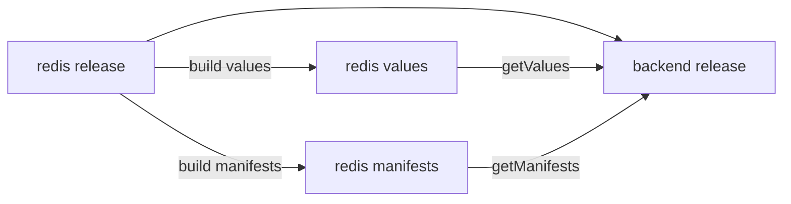

# Cross-release reference

> Introduced in [:material-tag: v0.43.0](https://github.com/helmwave/helmwave/releases/tag/v0.43.0)

Since v0.43.0, releases are built in dependency order. This means a release can reference the already-built manifests and values of its dependencies declared in `depends_on`.

This enables powerful cross-release data sharing:

- Access the entire plan configuration using `getPlan`. Useful for accessing the field of other releases, like `tags` or `store`.
- Access a dependency's rendered values using `getValues`.
- Access a dependency's rendered manifests using `getManifests`. Useful for retrieving helm-generated secrets.

## How it works



When helmwave builds the plan:

1. Releases are sorted by their dependency graph
2. Each release's values are built immediately before its manifests
3. Dependent releases can access their dependencies' built artifacts via template functions

## Example

**Project Structure**

```shell
⟨⟨ run_script("tree docs/examples/cross-release-reference") ⟩⟩
```

```yaml title="helmwave.yml"

```

```yaml title="values/redis.yml"

```

```yaml title="values/backend.yml"

```

## Template functions

### `getPlan`

Access the entire plan configuration, including all releases' `store` fields:

```yaml
{{ $plan := getPlan }}
{{ range $plan.releases }}
{{- if eq .name "redis" }}
redis_port: {{ .store.port }}
{{- end }}
{{ end }}
```

### `getValues`

Fetch rendered values from a depending release:

```yaml
{{ $redisValues := getValues "redis@my-namespace" "values/redis.yml" }}
redis_host: {{ $redisValues.connection.host }}
```

### `getManifests`

Fetch rendered manifests from a depending release as an array of Kubernetes objects. This is useful for accessing helm-generated secrets like random passwords:

```yaml
{{ $manifests := getManifests "redis@my-namespace" }}
{{- range $manifests }}
{{- if eq .kind "Secret" }}
redis_password: {{ index .data "redis-password" }}
{{- end }}
{{- end }}
```
