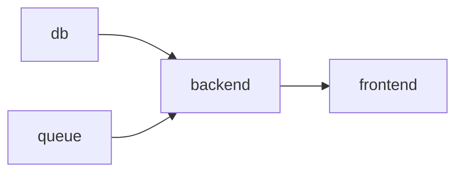

# DEPENDS_ON [ [source] ](https://github.com/helmwave/helmwave.github.io/tree/main/docs/examples/depends_on)


## Receipt

**Suppose we have application contains next services (of course, each service provide as helm-chart) :**

1. db
2. backend
3. frontend
4. queue

**Sequence**



**docker-compose** will be look like that:

```yaml

```

#### Project Structure

```
.
└── helmwave.yml.tpl

```

#### `helmwave.yml.tpl`

```yaml

```

## Deploy

```shell
$ helmwave deploy
```


