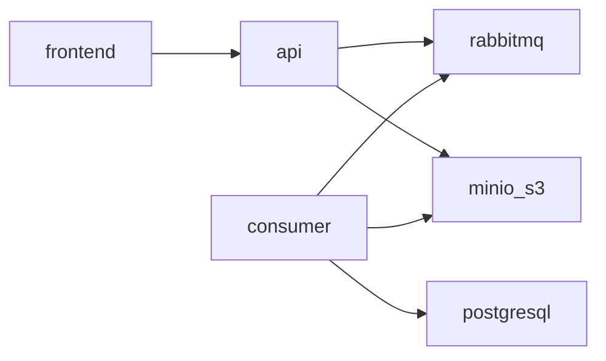

# ☂️ Umbrella chart is evil

> Helmwave is only what you actually need.

Why is Umbrella chart evil?

- You must keep extra chart.
- You have new layer for conventional values.
- Umbrella chart doesn't provide separate your environments.
- When sub-chart is modified, you need to fix it twice.

Suppose that you need to describe the next architecture.


*If you don't see a graph, please reload the page.*

Example of **helmwave.yml** for this architecture.

```yaml

```
