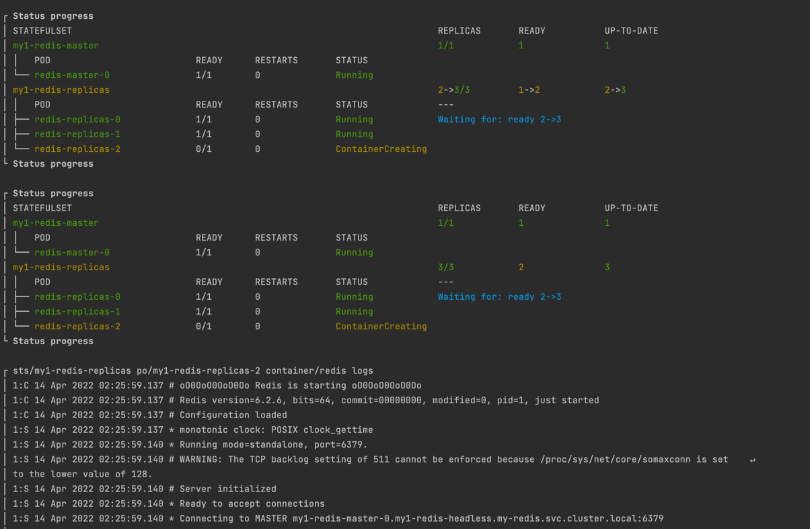

# Kubedog

> [ [Source] ](https://github.com/helmwave/docs/tree/0.19.x/docs/examples/kubedog)

[full documentation](https://helmwave.github.io/docs/0.19.x/anno/#kubedogs)

**Project Structure**

```
.
├── helmwave.yml
└── common.yml
```

Create `helmwave.yml`

```yaml

```


Then you should create `values.yml`

```yaml

```


We are going to use `commonAnnotations`. 

> `commonAnnotations` is a part of bitnami common library [chart](https://github.com/bitnami/charts/tree/master/bitnami/common).


**Run**

```console
helmwave up --build --kubedog
```

or 

```console
export HELMWAVE_KUBEDOG_ENABLED=true
export HELMWAVE_AUTO_BUILD=true
helmwave up
```

Log with helmwave v0.19.3


