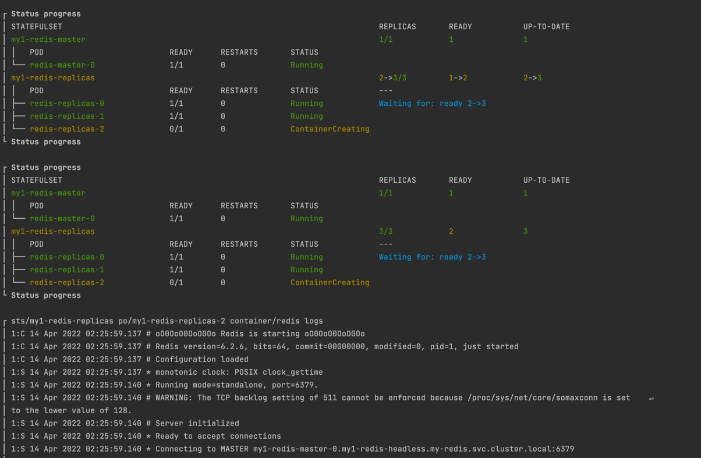

---
hide:
  - toc
---
# 🐶 Kubedog

!!! info "The first thing you need to do is turn on `kubedog`"

    ```shell
    export HELMWAVE_KUBEDOG_ENABLED=true
    ```

Kubedog will track all your resources by default.
For more information, see the [annotation's documentation](../../anno/#kubedogs).

**Project Structure**

```shell
⟨⟨ run_script("tree docs/examples/kubedog") ⟩⟩
```

Create `helmwave.yml`

```yaml title="helmwave.yml"

```

Then you should create `values.yml`

```yaml title="values.yml"

```

We are going to use `commonAnnotations`. 

> `commonAnnotations` is a part of bitnami common library [chart](https://github.com/bitnami/charts/tree/master/bitnami/common).

**Run**

!!! tip "You can combine `--kubedog` and [`--progress`](../cli/#log-level)"

```shell
helmwave up --build --kubedog
```

or 

```shell
export HELMWAVE_KUBEDOG_ENABLED=true
export HELMWAVE_AUTO_BUILD=true
helmwave up
```

**Output**


