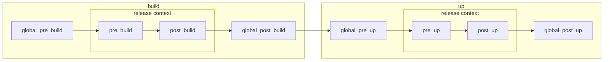

---
hide:
  - toc
---
# Lifecycle

Lifecycle defines scripts that are triggered by helmwave.

**Flow hooks for `helmwave up --build`**



```yaml title="helmwave.yml"

```

```shell title="$ helmwave build --diff-mode none"

```