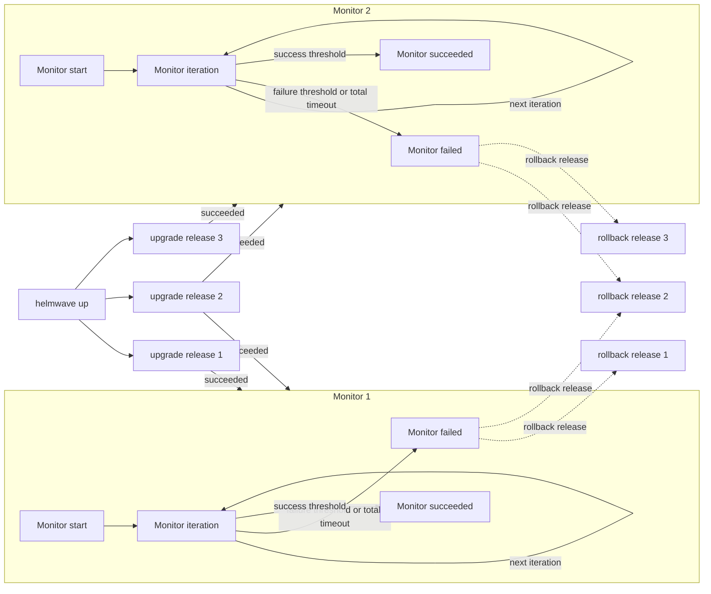

---
hide:
  - toc
---
# 🔎 Monitors

Monitors run custom releases validations and can rollback releases.

**Monitors flow**



```yaml title="helmwave.yml"

```

```shell title="$ helmwave build --diff-mode none"

```