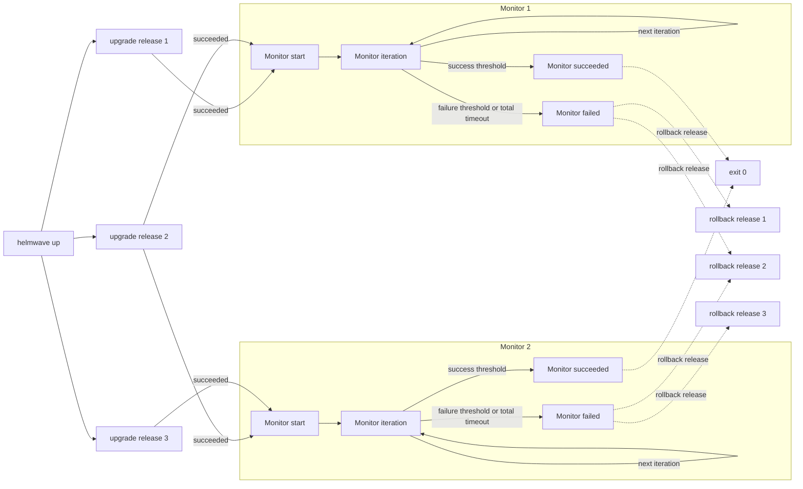

---
hide:
  - toc
---
# 🔎 Monitors

Monitors run custom releases validations and can rollback releases.

### Monitors flow



- Each monitor starts when its all dependant releases succeeded
- Each monitor runs its iterations every `iterval` with `iteration_timeout`
- Consecutive successful iterations are counted towards `success_threshold`
- Consecutive failed iterations are counted towards `failure_threshold`
- After all monitors exited dependant releases do actions for their failed monitors 

### Demo

[](https://asciinema.org/a/NMGo0NMZOMQjtx0bZPxtlETaL)

```yaml title="helmwave.yml"

```

```shell title="$ helmwave build --diff-mode none"

```