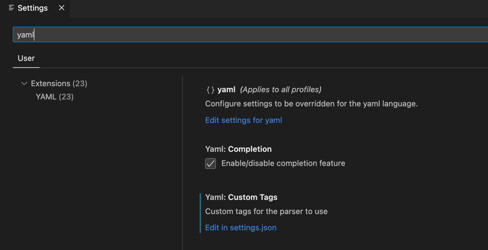
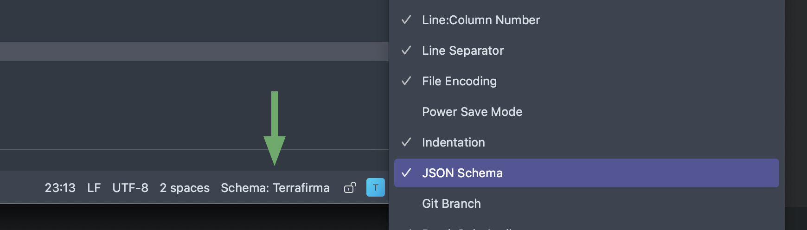
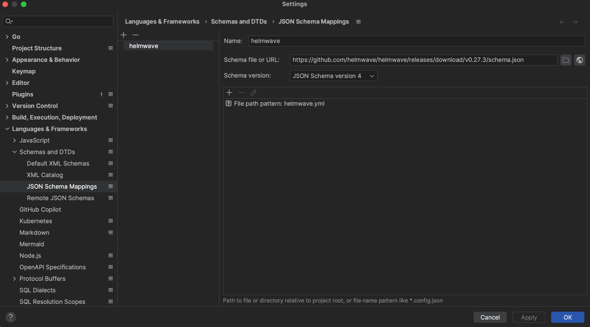
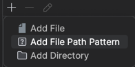

# 🔌 IDE supports

Currently, we don't have any plugins for popular IDEs. You can help us with it 🩵.

We can suggest you to use json schema for autocomplete and validate `helmwave.yml` in your IDE.

You can [generate schema](../cli/#schema) with cli command `helmwave schema` and use it in your IDE.

```shell
helmwave schema > helmwave.schema.json
```

Or you can get it from [:simple-github: github](https://github.com/helmwave/helmwave/releases/download/v0.27.3/schema.json)

```shell
wget -L https://github.com/helmwave/helmwave/releases/download/v0.27.3/schema.json -o helmwave.schema.json
```


=== ":material-microsoft-visual-studio-code: VScode"

    :material-code-json: **settings.json**

    ```json
    {
        "yaml.schemas": [
            {
                "fileMatch": [
                    "helmwave.yml"
                ],
                "url": "https://github.com/helmwave/helmwave/releases/download/v0.27.3/schema.json"
            }
        ]
    }
    ```

    


=== ":simple-intellijidea: IntelliJ IDEA"

    
    

    set file pattern: helmwave.yml

    

    restart idea.

    [:material-message-question: original ticket](https://youtrack.jetbrains.com/issue/IDEA-264507/How-do-I-tell-which-JSON-schema-is-applied-to-my-YAML-file)