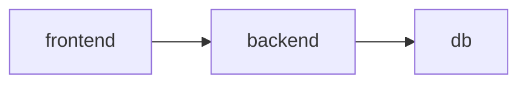

# Yaml

> Works on [helm v3.10.1](https://github.com/helmwave/helmwave/blob/v0.24.0/go.mod)

## helmwave.yml

|    field     | required |  type  | default |
| :----------: | :------: | :----: | :-----: |
|   project    |    🙅     | string |   ""    |
|   version    |    🙅     | string |   ""    |
| repositories |    🙅     | array  |   []    |
|  registries  |    🙅     | array  |   []    |
|   releases   |    🙅     | array  |   []    |

## project

> Reserved for future.

## version

Helmwave will check current version and project version.

In the future it is planned to check major compatibility. 

## Registries[]

> OCI registries

|  field   | required |  type  | default |
| :------: | :------: | :----: | :-----: |
|   host   |    ✅     | string |   ""    |
| username |    🙅     | string |   ""    |
| password |    🙅     | string |   ""    |
| insecure |    🙅     |  bool  |  false  |

**Examples**

- [private oci](../examples/oci-private)
- [github oci](../examples/oci-private)

## Repositories[]

|          field           | required |  type  | default |
| :----------------------: | :------: | :----: | :-----: |
|           name           |    ✅     | string |   ""    |
|           url            |    ✅     |  url   |   ""    |
|         username         |    🙅     | string |   ""    |
|         password         |    🙅     | string |   ""    |
|         certFile         |    🙅     | string |   ""    |
|         keyFile          |    🙅     | string |   ""    |
|          caFile          |    🙅     | string |   ""    |
| insecure_skip_tls_verify |    🙅     |  bool  |  false  |
|   pass_credentials_all   |    🙅     |  bool  |  false  |
|          force           |    🙅     |  bool  |  false  |

This repository will be stored in local helm repositories database.

### name

Local name alias.

### url

URL of the repository.

### force

Update existing repository exists if settings differ.

## Releases[]

> Almost all options that are here are native helm options

|            field            | required |       type       | default | `helmwave build` | `helmwave up` |
| :-------------------------: | :------: | :--------------: | :-----: | :--------------: | :-----------: |
|          **name**           |    ✅     |      string      |   ""    |        ✅         |       ✅       |
|        **namespace**        |    ✅     |      string      |   ""    |        ✅         |       ✅       |
|          **chart**          |    ✅     | string or object |   {}    |        ✅         |       ✅       |
|            store            |    🙅     |      object      |   {}    |        ✅         |               |
|         depends_on          |    🙅     |      array       |   []    |                  |       ✅       |
|           values            |    🙅     |      array       |   []    |        ✅         |       ✅       |
|            tags             |    🙅     |      array       |   []    |        ✅         |               |
|        post_renderer        |    🙅     |      array       |   []    |        ✅         |       ✅       |
|           timeout           |    🙅     |     interval     |   5m    |                  |       ✅       |
|         max_history         |    🙅     |       int        |    0    |                  |       ✅       |
|           context           |    🙅     |      string      |   ""    |                  |       ✅       |
|         description         |    🙅     |      string      |   ""    |                  |               |
|  pending_release_strategy   |    🙅     |      string      |   ""    |                  |       ✅       |
|        allow_failure        |    🙅     |       bool       |  false  |                  |       ✅       |
|           atomic            |    🙅     |       bool       |  false  |                  |       ✅       |
|       cleanup_on_fail       |    🙅     |       bool       |  false  |                  |       ✅       |
|      create_namespace       |    🙅     |       bool       |  false  |                  |       ✅       |
|            devel            |    🙅     |       bool       |  false  |                  |       ✅       |
|        disable_hooks        |    🙅     |       bool       |  false  |                  |       ✅       |
| disable_open_api_validation |    🙅     |       bool       |  false  |                  |       ✅       |
|            force            |    🙅     |       bool       |  false  |                  |       ✅       |
|          recreate           |    🙅     |       bool       |  false  |                  |       ✅       |
|        reset_values         |    🙅     |       bool       |  false  |                  |       ✅       |
|        reuse_values         |    🙅     |       bool       |  false  |                  |       ✅       |
|          skip_crds          |    🙅     |       bool       |  false  |                  |       ✅       |
|          sub_notes          |    🙅     |       bool       |  false  |                  |       ✅       |
|            wait             |    🙅     |       bool       |  false  |                  |       ✅       |
|        wait_for_jobs        |    🙅     |       bool       |  false  |                  |       ✅       |

### name

Release name. I hope you know what it is.

### namespace

Kubernetes namespace

### create_namespace

If set to `true` Helmwave will create the release namespace if not present.

### timeout

Time to wait for release to install.

### store 🗳️

It allows to pass your custom fields from `helmwave.yml` to values.

[example](../examples/store-greeting-hello/)

### tags 🔖

It allows you to choose releases for build

It works with next options when you call `helmwave build` (or `helmwave up --build`):

```console
--tags value, -t value  It allows you choose releases for build. Example: -t tag1 -t tag3,tag4 [$HELMWAVE_TAGS]
--match-all-tags        Match all provided tags (default: false) [$HELMWAVE_MATCH_ALL_TAGS]
```
 
**Matching with tags**

Suppose we have next `helmwave.yml` with 4 releases.

1. redis-a
2. redis-b
3. memcached-a
4. memcached-b


```yaml
repositories:
- name: bitnami
  url: https://charts.bitnami.com/bitnami

releases:
- name: redis-a
  namespace: test
  chart:
    name: bitnami/redis
  tags:
  - a
  - redis

- name: redis-b
  namespace: test
  chart:
    name: bitnami/redis
  tags:
  - b
  - redis

- name: memcached-a
  namespace: test
  chart:
    name: bitnami/redis
  tags:
  - a
  - memcached

- name: memcached-b
  namespace: test
  chart:
    name: bitnami/memcached
  tags:
  - b
  - memcached
```

**Match all redises**

```bash
helmwave build -t redis
[🙃 aka INFO]: 🏗 Plan
        releases: 
          - redis-a@test
          - redis-b@test
```

**Match the group `a`**

```bash
helmwave build -t a 
[🙃 aka INFO]: 🏗 Plan
        releases: 
          - redis-a@test
          - memcached-a@test
```

**Match any tags**

If you know SQL. It looks like that:

```sql
SELECT * FROM releases WHERE tag = "redis" OR tag = "a"
```

```bash
helmwave build -t redis -t a 
[🙃 aka INFO]: 🏗 Plan
        releases: 
          - redis-a@test
          - redis-b@test
          - memcached-a@test
```

**Match all tags**

All that was above, we used the logical `OR` operator.
If you need strongly logic with `AND` you should use `--match-all-tags` flag. 
This flag changes logic for query releases.

```bash
helmwave build --match-all-tags -t redis -t a 
[🙃 aka INFO]: 🏗 Plan
        releases: 
          - redis-a@test
```

### depends_on

It allows to set explicit dependencies between releases. Dependant release will start upgrading only after all it's dependencies finished upgrading

Example for [3-tier](https://searchsoftwarequality.techtarget.com/definition/3-tier-application) application



Your `helmwave.yml` should look like this:

```yaml
releases:
  - name: frontend
    depends_on:
      - backend
    namespace: test

  - name: backend
    depends_on:
      - db
    namespace: test

  - name: db
    allow_failure: false
    namespace: test
```

### allow_failure

Allows all dependant releases to proceed even if release failed.

### pending_release_strategy

Strategy to handle releases in pending statuses (`pending-install`, `pending-upgrade`, `pending-rollback`)

If helmwave tries to upgrade release that is currently in one of pending statuses it will follow specified strategy:

- `""` (or not specified) - do nothing. Helm will fail in this case
- `rollback` - rollback release to previous version. Upgrade will happen after rollback is complete
- `uninstall` - uninstall release. Upgrade will happen after uninstall is complete

### context

Allows to use custom kubecontext for release.

**Kubedog cannot be enabled when there are releases in multiple contexts.**

### post_renderer

You can use custom commands to change rendered manifests.

## Chart

|         field         | required |  type  | default |
| :-------------------: | :------: | :----: | :-----: |
|       **name**        |    ✅     | string |   ""    |
|      **version**      |    🙅     | string |   ""    |
|       username        |    🙅     | string |   ""    |
|       password        |    🙅     | string |   ""    |
|        cafile         |    🙅     | string |   ""    |
|       certfile        |    🙅     | string |   ""    |
|        keyfile        |    🙅     | string |   ""    |
| insecureskiptlsverify |    🙅     |  bool  |  false  |
|        keyring        |    🙅     | string |   ""    |
|  passcredentialsall   |    🙅     |  bool  |  false  |
|        verify         |    🙅     |  bool  |  false  |

> If chart is remote it will be downloaded into `.helmwave/charts` and downloaded archive will be used during deploy.

## Values[]

|      field      | required |  type  | default |
| :-------------: | :------: | :----: | :-----: |
|     **src**     |    ✅     | string |   ""    |
| delimiter_left  |    🙅     | string |  "{{"   |
| delimiter_right |    🙅     | string |  "}}"   |
|     strict      |    🙅     |  bool  |  false  |
|     render      |    🙅     |  bool  |  true   |

### delimiter_left, delimiter_right

You can change delimiter that helmwave uses to render values.

[example](../examples/values-delimiter-flags/)

### render

Allows to disable templating values at all.

[example](../examples/values-render-flag)

### strict

Allows to fail if values file doesn't exist.

[example](../examples/values-strict-flag)

## Depends_on[]

|  field   | required |  type  | default |
| :------: | :------: | :----: | :-----: |
|   name   |    🙅     | string |   ""    |
|   tag    |    🙅     | string |   ""    |
| optional |    🙅     |  bool  |  false  |

### name

Name of release (dependency) that has to be installed/upgraded before this release (dependant). If dependency is not in plan, it will be added to plan.

### tag

You can include all releases that match this tag to be added as dependencies. If tag is not in plan, it will be added to plan.

The planfile (`.helmwave/planfile` by default) will have normalized list of releases instead of tags.

### optional

If dependency is not found in all available releases, helmwave will not fail due to missing dependency.