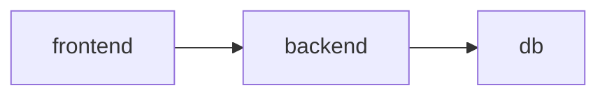

# Yaml

> works on [helm v3.7.1](https://github.com/helmwave/helmwave/blob/v0.16.2/go.mod)

Sample: 

```yaml
project: my-project
version: dev
repositories:
- name: bitnami
  url: https://charts.bitnami.com/bitnami
  username: ""
  password: ""
  certfile: ""
  keyfile: ""
  cafile: ""
  insecureskiptlsverify: false
  force: false
  allow_faulure: true
releases:
- store:
    pullPolicy: Always
  chart:
    name: bitnami/nginx
    cafile: ""
    certfile: ""
    keyfile: ""
    insecureskiptlsverify: false
    keyring: ""
    password: ""
    repourl: ""
    username: ""
    verify: false
    version: ""
  name: nginx
  namespace: test
  description: ""
  depends_on: []
  values: 
  - .helmwave/values/nginx@test/5ae83192a2a53eec01dee5207fcf3cccbc5af87f.yml
  - tests/07_values.yaml
  tags: []
  timeout: 0s
  maxhistory: 0
  createnamespace: false
  resetvalues: false
  recreate: false
  force: false
  atomic: false
  cleanuponfail: false
  subnotes: false
  disablehooks: false
  disableopenapivalidation: false
  waitforjobs: false
  wait: false
  skipcrds: false
  devel: false
  reusevalues: false
```


## Project

Reserved for future.

## Version

Check current version and project version.

In the future it is planned to be used for major compatibility. 

## Repositories[]

field | required | type  | default
:----:|:----:|:----:|:----:
name |  ✅   |  string | ""
url  |  ✅   |  url    | ""
username | 🙅 | string | ""
password | 🙅 | string | ""
certfile | 🙅 | string | ""
keyfile | 🙅 | string  | ""
cafile| 🙅 | string    | ""
insecureskiptlsverify | 🙅 | bool | false
force | 🙅 | bool | false

### force

Don't skip if repository exists.

## Releases[]


field | required | type  | default
:----:|:----:|:----:|:----:
name            | ✅ | string | ""
namespace       | ✅ | string | ""
chart.name      | ✅ | string | ""
chart.username  | 🙅 | string | ""
chart.password  | 🙅 | string | ""
chart.certfile  | 🙅 | string | ""
chart.keyfile   | 🙅 | string  | ""
chart.cafile    | 🙅 | string    | ""
chart.insecureskiptlsverify | 🙅 | bool | false
description      | 🙅 | string  | ""
depends_on       | 🙅 | array   | []
values           | 🙅 | array   | []
tags             | 🙅 | array   | []
store            | 🙅 | object  | {}
timeout          | 🙅 | interval   | 0s
maxhistory       | 🙅 | int   | 0
createnamespace  | 🙅 | bool    | false
resetvalues      | 🙅 | bool    | false
recreate| 🙅 | bool    | false
force| 🙅 | bool    | false
atomic| 🙅 | bool    | false
cleanuponfail| 🙅 | bool    | false
subnotes| 🙅 | bool    | false
disablehooks| 🙅 | bool    | false
disableopenapivalidation| 🙅 | bool    | false
waitforjobs| 🙅 | bool    | false
wait| 🙅 | bool    | false
skipcrds| 🙅 | bool    | false
devel| 🙅 | bool    | false
reusevalues| 🙅 | bool    | false


### 🗳️ Store

> It allows to pass you custom fields from helmwave.yml to values.

It works when you call `$ helmwave build`

### depends_on

> It allows waiting releases

It works when you call `$ helmwave up`


Example for [3-tier](https://searchsoftwarequality.techtarget.com/definition/3-tier-application) application



Your helmwave will

```yaml
n

releases:
  - name: frontend
    depends_on: backend@test
    namespace: test

  - name: backend
    depends_on: db@test
    namespace: test

  - name: db
    allow_failure: false
    namespace: test
```

When `allow_failure` is set true. It allows the installation to proceed.


### 🔖 Tags

> It allows you to choose releases for build

It works with next options when you call `$ helmwave build`:

```bash
--tags value, -t value  It allows you choose releases for build. Example: -t tag1 -t tag3,tag4 [$HELMWAVE_TAGS]
--match-all-tags        Match all provided tags (default: false) [$HELMWAVE_MATCH_ALL_TAGS]
```

#### Matching with tags

Suppose we have next `helmwave.yml` with 4 releases.

1. redis-a
2. redis-b
3. memcached-a
4. memcached-b


```yaml
repositories:
- name: bitnami
  url: https://charts.bitnami.com/bitnami

releases:
- name: redis-a
  namespace: test
  chart:
    name: bitnami/redis
  tags:
  - a
  - redis

- name: redis-b
  namespace: test
  chart:
    name: bitnami/redis
  tags:
  - b
  - redis

- name: memcached-a
  namespace: test
  chart:
    name: bitnami/redis
  tags:
  - a
  - memcached


- name: memcached-b
  namespace: test
  chart:
    name: bitnami/memcached
  tags:
  - b
  - memcached
```


Match all redis

```bash
helmwave build -t redis
[🙃 aka INFO]: 🏗 Plan
        releases: 
          - redis-a@test
          - redis-b@test
```


Match the group `a`

```bash
helmwave build -t a 
[🙃 aka INFO]: 🏗 Plan
        releases: 
          - redis-a@test
          - memcached-a@test
```


Match multiply group.

If you know SQL. It looks like that:

```sql
SELECT * FROM releases WHERE tag = "redis" OR tag = "a"
```

```bash
helmwave build -t redis -t a
[🙃 aka INFO]: 🏗 Plan
        releases: 
          - redis-a@test
          - redis-b@test
          - memcached-a@test
```

All that was above, we used the logical `OR` operator.
If you need strongly logic with `AND` you should use `--match-all-tags` flag. 
This flag changes logic for query releases.

If you know SQL. It looks like that:

```sql
SELECT * FROM releases WHERE tag = "redis" AND tag = "a"
```

```bash
helmwave build -t redis -t a --match-all-tags
[🙃 aka INFO]: 🏗 Plan
        releases: 
          - redis-a@test
```


### createnamespace

> if `true` Helmwave will create namespace for release.

