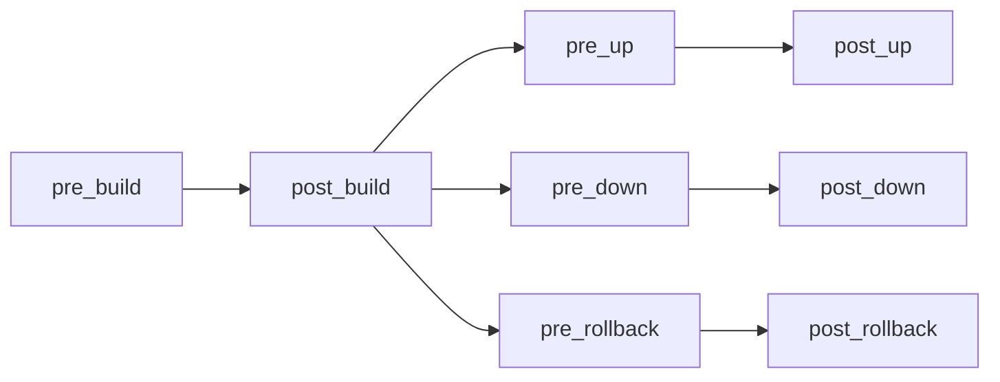

# 🧬 helmwave.yml

This documentation describes all entities inside a `helmwave.yml`

|    field     | required |  type  | default |
|:------------:|:--------:|:------:|:-------:|
|   project    |    🙅    | string |   ""    |
|   version    |    🙅    | string |   ""    |
| repositories |    🙅    | array  |   []    |
|  registries  |    🙅    | array  |   []    |
|  lifecycle   |    🙅    | object |   {}    |
|   releases   |    🙅    | array  |   []    |

=== "Short `helmwave.yml`"

    ```yaml
    project: "HelloWorld"
    version: "⟨⟨ ver ⟩⟩"
    repositories: []
    registries: []
    releases: []
    lifecycle:
      pre_up: []
      post_up: []
      pre_down: []
      post_down: []
      pre_build: []
      post_build: []
      pre_rollback: []
      post_rollback: []
    ```

=== "Full `helmwave.yml`"

    ```yaml
    
    ```

## project

Reserved for the future.

## version

Helmwave will check the current version and project version.

In the future, it is planned to check major compatibility. 

## registries[]

> Introduced in [:material-tag: v0.19.0](https://github.com/helmwave/helmwave/releases/tag/v0.19.0)

Describe which [OCI registries](https://helm.sh/docs/topics/registries/) need to be added.

|  field   | required |  type  | default |
|:--------:|:--------:|:------:|:-------:|
|   host   |    ✅     | string |   ""    |
| username |    🙅    | string |   ""    |
| password |    🙅    | string |   ""    |
| insecure |    🙅    |  bool  |  false  |


=== ":material-duck: private oci"

    ```yaml
    
    ```

=== ":material-duck: public oci"
    
    ```yaml
    
    ```

### host

Host of the registry.

### username

Username for the registry.

!!! note "only if registry is private"


### password

Password for the registry.

!!! note "only if registry is private"


## repositories[]

:simple-helm: helm [repositories](https://helm.sh/docs/helm/helm_repo) also know as `helm repo add`

|          field           | required |  type  | default |
|:------------------------:|:--------:|:------:|:-------:|
|           name           |    ✅     | string |   ""    |
|           url            |    ✅     |  url   |   ""    |
|         username         |    🙅    | string |   ""    |
|         password         |    🙅    | string |   ""    |
|          force           |    🙅    |  bool  |  false  |
|         certFile         |    🙅    | string |   ""    |
|         keyFile          |    🙅    | string |   ""    |
|          caFile          |    🙅    | string |   ""    |
| insecure_skip_tls_verify |    🙅    |  bool  |  false  |
|   pass_credentials_all   |    🙅    |  bool  |  false  |

This repository will be stored in a local :simple-helm: helm repositories database.

### name

Local name alias.

### url

URL of the repository.

### username

Username for the repository.

### password

Password for the repository.


### force

Update existing repository exists if settings differ.

## lifecycle

> Aka global hooks. Introduced in [:material-tag: v0.28.0](https://github.com/helmwave/helmwave/releases/tag/v0.28.0)

We don't call lifecycle the hooks on purpose
so as not to confuse you with the original functionality of [:simple-helm: helm hooks](https://helm.sh/docs/topics/charts_hooks/).


|     field     | required | type  | default |
|:-------------:|:--------:|:-----:|:-------:|
|    pre_up     |    🙅    | array |   []    |
|    post_up    |    🙅    | array |   []    |
|   pre_down    |    🙅    | array |   []    |
|   post_down   |    🙅    | array |   []    |
|   pre_build   |    🙅    | array |   []    |
|  post_build   |    🙅    | array |   []    |
| pre_rollback  |    🙅    | array |   []    |
| post_rollback |    🙅    | array |   []    |

|     field     | required |  type  | default |
|:-------------:|:--------:|:------:|:-------:|
|      cmd      |    ✅     | string |   ""    |
|     args      |    🙅    | array  |   []    |
|     show      |    🙅    |  bool  |  true   |
| allow_failure |    🙅    |  bool  |  false  |


=== "short syntax"

    ```yaml
    version: ⟨⟨ ver ⟩⟩
    lifecycle:
      pre_build:
        - echo "run global pre_build script"
    ```

=== "full syntax"

    ```yaml
    version: ⟨⟨ ver ⟩⟩
    lifecycle:
      pre_build:
        - cmd: echo 
          args:
            - "run global pre_build script"
          show: true
          allow_failure: false
    ```



[:material-duck: example](examples/lifecycle/README.md)

**environment**

> Introduced in [:material-tag: v0.29.0](https://github.com/helmwave/helmwave/releases/tag/v0.29.0)

To each lifecycle command several environment variables are passed:

- `${HELMWAVE_LIFECYCLE_TYPE}` - contains lifecycle stage/type (`pre_build`/`post_build`/etc.)
- `${HELMWAVE_LIFECYCLE_RELEASE_UNIQNAME}` - *(only for per-release lifecycle)* contains release uniqname (`release@namespace`)


## releases[]

Almost all options that are here are native :simple-helm: helm options.

|            field            | required |       type       | default | `helmwave build` |  helm option  |
|:---------------------------:|:--------:|:----------------:|:-------:|:----------------:|:-------------:|
|          **name**           |    ✅     |      string      |   ""    |        ✅         | :simple-helm: |
|        **namespace**        |    ✅     |      string      |   ""    |        ✅         | :simple-helm: |
|          **chart**          |    ✅     | string or object |   {}    |        ✅         | :simple-helm: |
|      create_namespace       |    🙅    |       bool       |  false  |                  | :simple-helm: |
|           values            |    🙅    |      array       |   []    |        ✅         | :simple-helm: |
|            tags             |    🙅    |      array       |   []    |        ✅         |               |
|    offline_kube_version     |    🙅    |      string      |   ""    |        ✅         |               |
|            store            |    🙅    |      object      |   {}    |        ✅         |               |
|          lifecycle          |    🙅    |      object      |   {}    |        ✅         |               |
|         depends_on          |    🙅    |      array       |   []    |        ✅         |               |
|        allow_failure        |    🙅    |       bool       |  false  |                  |               |
|  pending_release_strategy   |    🙅    |      string      |   ""    |                  |               |
|            wait             |    🙅    |       bool       |  false  |                  | :simple-helm: |
|        wait_for_jobs        |    🙅    |       bool       |  false  |                  | :simple-helm: |
|           timeout           |    🙅    |     interval     |   5m    |                  | :simple-helm: |
|         max_history         |    🙅    |       int        |    0    |                  | :simple-helm: |
|           context           |    🙅    |      string      |   ""    |                  |               |
|         description         |    🙅    |      string      |   ""    |                  | :simple-helm: |
|           atomic            |    🙅    |       bool       |  false  |                  | :simple-helm: |
|       cleanup_on_fail       |    🙅    |       bool       |  false  |                  | :simple-helm: |
|            devel            |    🙅    |       bool       |  false  |                  | :simple-helm: |
|        disable_hooks        |    🙅    |       bool       |  false  |                  | :simple-helm: |
| disable_open_api_validation |    🙅    |       bool       |  false  |                  | :simple-helm: |
|            force            |    🙅    |       bool       |  false  |                  | :simple-helm: |
|         enable_dns          |    🙅    |       bool       |  false  |                  | :simple-helm: |
|          recreate           |    🙅    |       bool       |  false  |                  | :simple-helm: |
|        reset_values         |    🙅    |       bool       |  false  |                  | :simple-helm: |
|        reuse_values         |    🙅    |       bool       |  false  |                  | :simple-helm: |
|          skip_crds          |    🙅    |       bool       |  false  |                  | :simple-helm: |
|          sub_notes          |    🙅    |       bool       |  false  |                  | :simple-helm: |
|        post_renderer        |    🙅    |      array       |   []    |        ✅         | :simple-helm: |

### name

> Introduced in [:material-tag: v0.5.0](https://github.com/helmwave/helmwave/releases/tag/v0.5.0)


Release name. I hope you know what it is.

### namespace

> Introduced in [:material-tag: v0.5.0](https://github.com/helmwave/helmwave/releases/tag/v0.5.0)


:simple-kubernetes: kubernetes namespace.

### chart

> Introduced in [:material-tag: v0.5.0](https://github.com/helmwave/helmwave/releases/tag/v0.5.0)


|         field          | required |  type  | default |
|:----------------------:|:--------:|:------:|:-------:|
|        **name**        |    ✅     | string |   ""    |
|      **version**       |    🙅    | string |   ""    |
|        username        |    🙅    | string |   ""    |
|        password        |    🙅    | string |   ""    |
|        ca_file         |    🙅    | string |   ""    |
|       cert_file        |    🙅    | string |   ""    |
|        key_file        |    🙅    | string |   ""    |
|        insecure        |    🙅    |  bool  |  false  |
|        keyring         |    🙅    | string |   ""    |
|    pass_credentials    |    🙅    |  bool  |  false  |
|         verify         |    🙅    |  bool  |  false  |
| skip_dependency_update |    🙅    |  bool  |  false  |
|      skip_refresh      |    🙅    |  bool  |  false  |

`chart` can be an object or a string. If it's a string, it will be treated as a `name`.

=== "short syntax"
    
    > Introduced in [:material-tag: v0.20.0](https://github.com/helmwave/helmwave/releases/tag/v0.20.0)
    

    ```yaml
    releases:
      - name: my-release
        namespace: my-namespace
        chart: my-chart
    ```

=== "long syntax"

    ```yaml
    releases:
      - name: my-release
        namespace: my-namespace
        chart:
          name: my-chart
    ```


!!! tip "If chart is remote it will be downloaded into `.helmwave/charts` and downloaded archive will be used during deploy."

#### name

Can be `oci://`, local or repository chart.

=== oci

    ```yaml
    releases:
      - name: my-release
        namespace: my-namespace
        chart: oci://my-registry.io/my-chart
    ```

=== local

    ```yaml
    releases:
      - name: my-release
        namespace: my-namespace
        chart: ./my-chart
    ```

=== repository

    ```yaml
    releases:
      - name: my-release
        namespace: my-namespace
        chart: bitnami/nats
    ```

#### version

Chart version. If not set, latest will be used.

    ```yaml
    releases:
      - name: my-release
        namespace: my-namespace
        chart:
          name: my-chart
          version: 1.2.3
    ```

#### skip_dependency_update

> Introduced in [:material-tag: v0.29.1](https://github.com/helmwave/helmwave/releases/tag/v0.29.1)

Disable Helm dependency update.

#### skip_refresh

> Introduced in [:material-tag: v0.29.1](https://github.com/helmwave/helmwave/releases/tag/v0.29.1)

Disable Helm repository refresh.


### create_namespace

> Introduced in [:material-tag: v0.12.0](https://github.com/helmwave/helmwave/releases/tag/v0.12.0)

If set to `true` Helmwave will create the release namespace if not present.


```shell
helm upgrade --install --create-namespace my-release my-chart --namespace my-namespace
```

```yaml
releases:
  - name: my-release
    namespace: my-namespace
    chart: my-chart
    create_namespace: true
```


### values[]

> Introduced in [:material-tag: v0.5.0](https://github.com/helmwave/helmwave/releases/tag/v0.5.0)


> `values` can be an object or a string. If it's a string, it will be treated as a `src` field.

|      field      | required |  type  | default |
|:---------------:|:--------:|:------:|:-------:|
|     **src**     |    ✅     | string |   ""    |
| delimiter_left  |    🙅    | string |  "{{"   |
| delimiter_right |    🙅    | string |  "}}"   |
|     strict      |    🙅    |  bool  |  false  |
|     render      |    🙅    |  bool  |  true   |

=== "short syntax"

    ```yaml
    values:
      - values.yaml
      - values2.yaml
    ```

=== "full syntax"

    ```yaml
    values:
      - src: values.yaml
        delimiter_left: "{{"
        delimiter_right: "}}"
        strict: false
        render: true
    ```

#### **src**

Path to values file. It can be local or remote.

#### delimiter_left, delimiter_right

> Introduced in [:material-tag: v0.24.0](https://github.com/helmwave/helmwave/releases/tag/v0.24.0)


You can change the delimiter that helmwave uses to render values.

[:material-duck: example](../examples/values-delimiter-flags/)

#### render

> Introduced in [:material-tag: v0.20.0](https://github.com/helmwave/helmwave/releases/tag/v0.20.0)
    

Allows disabling templating values at all.

[:material-duck: example](examples/values-render-flag/README.md)

#### strict

> Introduced in [:material-tag: v0.20.0](https://github.com/helmwave/helmwave/releases/tag/v0.20.0)
    

Allows to fail if values file doesn't exist.

[:material-duck: example](examples/values-strict-flag/README.md)

### tags[]
> Aka labels. Introduced in [:material-tag: v0.4.0](https://github.com/helmwave/helmwave/releases/tag/v0.4.0)

Tags allow you to choose releases for build.


[:material-duck: example](examples/tags/README.md)

### offline_kube_version

> Introduced in [:material-tag: v0.27.3](https://github.com/helmwave/helmwave/releases/tag/v0.27.3)

If `offline_kube_version` set helmwave will use this version to build plan.
Without this option, helmwave will ask :simple-kubernetes: kubernetes for a version. 
It is very useful if you want to build a plan without access to a cluster.

Combine `offline_kube_version` and `--diff-mode=local` or `--diff-mode=none` to build a plan without kubernetes.


[:material-duck: example](examples/private-env/README.md)

### store

> Introduced in [:material-tag: v0.2.0](https://github.com/helmwave/helmwave/releases/tag/v0.2.0)


It allows passing your custom fields from `helmwave.yml` to values.

[:material-duck: example](examples/store-greeting-hello/README.md)

### lifecycle

> Aka hooks. Introduced in [:material-tag: v0.28.0](https://github.com/helmwave/helmwave/releases/tag/v0.28.0)

[:material-duck: example](examples/lifecycle/README.md)

### depends_on[]

> Introduced in [:material-tag: v0.9.0](https://github.com/helmwave/helmwave/releases/tag/v0.9.0)


`depends_on` can be an object or a string. If it's a string, it will be treated as a `name`.

|  field   | required |  type  | default |
|:--------:|:--------:|:------:|:-------:|
| **name** |    🙅    | string |   ""    |
|   tag    |    🙅    | string |   ""    |
| optional |    🙅    |  bool  |  false  |

`depends_on` is a list of releases that allow you to deploy a sequence.

!!! example "Example for [3-tier](https://searchsoftwarequality.techtarget.com/definition/3-tier-application) application"

    ```mermaid
    graph LR
        frontend --> backend --> db;
    ```
    *If you don't see a graph, please reload the page.*


Your `helmwave.yml` should look like this:

```yaml
releases:
  - name: frontend
    depends_on:
      - backend
    namespace: test

  - name: backend
    depends_on:
      - db
    namespace: test

  - name: db
    allow_failure: false
    namespace: test
```

#### **name**

Name of release (dependency) that has to be installed/upgraded before this release (dependant). If dependency is not in a plan, it will be added to a plan.

Name support 2 kind of definitions: uniq name `<release-name>@<namespace>` or just `<release-name>`.
If namespace is not specified, it will be taken from namespace filed of release.


The same configuration can be written in 2 ways:

=== "`<release-name>`"
    
    > Introduced in [:material-tag: v0.21.1](https://github.com/helmwave/helmwave/releases/tag/v0.21.1)

    ```yaml
    releases:
      - name: backend
        namespace: test
        depends_on:
          - name: redis

    - name: redis
      namespace: test
    ```

=== "`<release-name>@<namespace>`"

    ```yaml
    releases:
      - name: backend
        namespace: test
        depends_on:
          - name: redis@test

    - name: redis
      namespace: test
    ```


Both of them will be normalized to `redis@test` in a planfile.


#### tag

> Introduced in [:material-tag: v0.24.0](https://github.com/helmwave/helmwave/releases/tag/v0.24.0)

You can include all releases that match this tag to be added as dependencies.
If a tag is not in a plan, it will be added to a plan.

The planfile (`.helmwave/planfile` by default) will have a normalized list of releases instead of tags.

#### optional

> Introduced in [:material-tag: v0.24.0](https://github.com/helmwave/helmwave/releases/tag/v0.24.0)


If dependency is not found in all available releases, helmwave will not fail due to missing dependency.


It allows setting explicit dependencies between releases. Dependant release will start upgrading only after all its dependencies finished upgrading

### allow_failure

> Introduced in [:material-tag: v0.15.0](https://github.com/helmwave/helmwave/releases/tag/v0.15.0)

Allows all dependant releases to proceed even if release failed.

### pending_release_strategy

> Introduced in [:material-tag: v0.21.0](https://github.com/helmwave/helmwave/releases/tag/v0.21.0)

Strategy to handle releases in pending statuses (`pending-install`, `pending-upgrade`, `pending-rollback`)

If helmwave tries to upgrade release that is currently in one of the pending statuses,
it will follow specified strategy:

- `""` (or not specified) - do nothing. :simple-helm: helm will fail in this case;
- `rollback` - rollback release to a previous version. Upgrade will happen after `rollback` is complete;
- `uninstall` - uninstall release. Upgrade will happen after `uninstall` is complete.

### wait

We recommend using `wait` for all releases. It will wait for all resources to be ready.

### wait_for_jobs

> Introduced in [:material-tag: v0.12.0](https://github.com/helmwave/helmwave/releases/tag/v0.12.0)


We recommend using `wait_for_jobs` for all releases. It will wait for all jobs to be completed.

### timeout

> Introduced in [:material-tag: v0.5.0](https://github.com/helmwave/helmwave/releases/tag/v0.5.0)

Time to wait for release to install.

!!! danger "if you enable `kubedog` this option will be required."

### max_history

> Introduced in [:material-tag: v0.5.0](https://github.com/helmwave/helmwave/releases/tag/v0.5.0)

Limit the maximum number of revisions saved per release. Use 0 for no limit (default 0)

???+ tip "Recommendation is using `3` for this option."

    `previous release` + `current release` + `next release` = **`3`**

### context

> Introduced in [:material-tag: v0.24.0](https://github.com/helmwave/helmwave/releases/tag/v0.24.0)


Allows using custom :simple-kubernetes: kube-context for release.

!!! danger "Kubedog can't be enabled when there are releases in multiple contexts."

### description

> Introduced in [:material-tag: v0.12.0](https://github.com/helmwave/helmwave/releases/tag/v0.12.0)


Additional information about release.

### atomic

> Introduced in [:material-tag: v0.5.0](https://github.com/helmwave/helmwave/releases/tag/v0.5.0)


if set, upgrade process rolls back changes made in case of failed upgrade.

### cleanup_on_fail

> Introduced in [:material-tag: v0.12.0](https://github.com/helmwave/helmwave/releases/tag/v0.12.0)


Allow deletion of new resources created in this upgrade when upgrade fails.

### devel

> Introduced in [:material-tag: v0.12.0](https://github.com/helmwave/helmwave/releases/tag/v0.12.0)


Use development versions, too. Equivalent to version '>0.0.0-0'.

### disable_hooks

> Introduced in [:material-tag: v0.12.0](https://github.com/helmwave/helmwave/releases/tag/v0.12.0)


Disable pre/post upgrade :simple-helm:  helm hooks

### disable_open_api_validation

> Introduced in [:material-tag: v0.12.0](https://github.com/helmwave/helmwave/releases/tag/v0.12.0)


If set, the upgrade process will not validate rendered templates against the Kubernetes OpenAPI Schema

### force

> Introduced in [:material-tag: v0.5.0](https://github.com/helmwave/helmwave/releases/tag/v0.5.0)


Force resource updates through a replacement strategy

!!! tip "We don't recommend using this option."

### enable_dns

> Introduced in [:material-tag: v0.27.1](https://github.com/helmwave/helmwave/releases/tag/v0.27.1)


Enable DNS resolution in templates.

### recreate

> Introduced in [:material-tag: v0.5.0](https://github.com/helmwave/helmwave/releases/tag/v0.5.0)


Allows deleting and then creating resources (pods) when needed instead of updating.

!!! tip "We don't recommend using this option."


### reset_values

> Introduced in [:material-tag: v0.5.0](https://github.com/helmwave/helmwave/releases/tag/v0.5.0)


When upgrading, reset the values to the ones built into the chart.

### reuse_values

> Introduced in [:material-tag: v0.5.0](https://github.com/helmwave/helmwave/releases/tag/v0.5.0)


When upgrading, reuse the last release's values and merge it into the new configuration.

!!! tip "We don't recommend using this option."

### skip_crds

> Introduced in [:material-tag: v0.12.0](https://github.com/helmwave/helmwave/releases/tag/v0.12.0)


If set, no CRDs will be installed. By default, CRDs are installed if not already present.

Be careful with this option.

- If you have a release that depends on CRDs, it will fail.
- Sometimes you should enable `installCRD: true` in your chart like cert-manager.

### sub_notes

> Introduced in [:material-tag: v0.12.0](https://github.com/helmwave/helmwave/releases/tag/v0.12.0)


If set, render sub chart notes along with the parent.
This option determines whether sub-notes are rendered in the chart.

### post_renderer

> Introduced in [:material-tag: v0.24.0](https://github.com/helmwave/helmwave/releases/tag/v0.24.0)


You can use custom commands to change rendered manifests.
