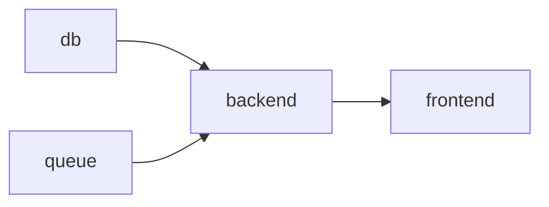

# depends_on 

Nowadays, `depends_on` is unstable feature.
You need enable it before v1.0.0 manually.

```bash
export HELMWAVE_ENABLE_DEPENDENCIES=true
```


**Suppose we have application contains next services (of course, each service provide as helm-chart) :**

1. db
2. backend
3. frontend
4. queue

**Sequence**



**docker-compose** will be look like that:

```yaml

```

#### Project Structure

```
.
└── helmwave.yml.tpl

```

#### `helmwave.yml.tpl`

```yaml

```

## Deploy

```shell
helmwave deploy
```


